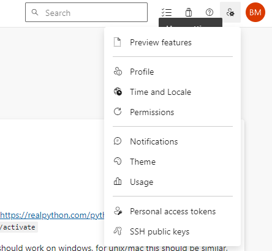

# Starter Project

This is the starter project for the Azure Environment. Here we will set up the development environment and make a basic call to the Azure OpenAI-API. In general we will use python to make calls to the OpenAI-API and Visual Studio Code is the recommeded IDE.

## Setup of environment

### Python

To be able to execute this environment, one has to have python installed and enabled. It is recommended to use virtual environments (see https://realpython.com/python-virtual-environments-a-primer/).

##### Windows

For Windows, you can create virtual environment  with the command: `python -m venv venv`
And activate it with the command: `./venv/Scripts/activate`

Afterwards one has to install the required python packages with the following command: `pip install -r requirements_windows.txt`

##### macOS

For MacBook users, you can create virtual environment with the command: `python3 -m venv .venv`. After running the command you should be able to see directory `.venv` in the root project. DO NOT COMMIT the new folder.
Next step is to activate your environment with the command: `source .venv/bin/activate`

After that, you can proceed to installing required python packages with the following command: `pip3 install -r requirements_mac.txt`

Once completed, you should be fine python-wise.

### API-Keys and endpoints

To be able to use the Azure-OpenAI-Resources, one has to enter the keys and urls of the corresponding endpoints. For that you copy the .samle.env-file and rename it to .env. This .env-file is there to store your credentials and shall NEVER be checked in into git. Here you have to enter your credentials. In our case, this is only the `OCP_APIM_SUBSCRIPTION_KEY`, which you can get out of the common chat or from the orga staff.

In general, the principle is to never deploy new OpenAI-Resources. There are common resources in the common resource group available, like azure cognitive search.
For your personal non-AI-deployments (servers and whatever you need), please use the joint resource group `rg-training-sdlc-july24` and name the resources you create after your team, e.g. `Zurich-Team-1-VM`. For any other questions, please refer to the manual of `sabin.bhandari@avanade.com` (sent in the general chat).

## Overview about the APIs available

There are multiple ways available, how to call the AzureOpenAI-APIs, most used are the REST-API and the even handier python-sdk from OpenAI.
You can find useful links below:

These both resources include important information, to pay attention to, when connection to Microsoft Azure Endpoints

- https://github.com/openai/openai-python
- https://pypi.org/project/openai/

Other documentation:

- https://platform.openai.com/docs/api-reference/introduction
- https://learn.microsoft.com/en-us/azure/ai-services/openai/quickstart?tabs=command-line&pivots=programming-language-studio

## Overview about the Azure Resources available in the sandbox

- Chat Endpoint URL: 
https://az-apim-svc-westeurope.azure-api.net/openai/deployments/{deployment-name}/chat/completions 
- Embeddings Endpoint URL: https://az-apim-svc-westeurope.azure-api.net/openai/deployments/text-embedding-ada-002/embeddings?api-version=2023-05-15 

### Available Models (Deployment Name)
- gpt-35-turbo-4k-0613 
- gpt-35-turbo-16k-0613 
- gpt-4-1106 (GPT 4 Turbo) 
- gpt-4-vision 
- gpt-4o (api-version: 2024-02-15-preview)
- text-embedding-ada-002 

### Available Models for Special Cases
To access the modles listed below, a spezial [request](https://nam11.safelinks.protection.outlook.com/?url=https%3A%2F%2Faccenture.qualtrics.com%2Fjfe%2Fform%2FSV_8nLVklZQFHc1hTE&data=05%7C01%7Csabin.bhandari%40avanade.com%7C8057a662e92c4a35c44b08dbce10bbf9%7Ccf36141cddd745a7b073111f66d0b30c%7C0%7C0%7C638330343604451438%7CUnknown%7CTWFpbGZsb3d8eyJWIjoiMC4wLjAwMDAiLCJQIjoiV2luMzIiLCJBTiI6Ik1haWwiLCJXVCI6Mn0%3D%7C3000%7C%7C%7C&sdata=%2BDqCRQ9NBUGHTBGu%2FaifTHIosK%2B6%2BbY1d%2BCOEy81XU0%3D&reserved=0)
has to be made.
- other embedding models 
- gpt-35-turbo-instruct 
- gpt-4-32k (Currently not offered due to price consideration) 
- whisper 
- other models 

Source: [Original Document](https://myoffice.accenture.com/:w:/g/personal/sabin_bhandari_accenture_com/EVJZYeyBEDZBvQ6vL9yLK7UB64xXU8dsm3lfXGxqOsCTjw?e=5jyv07)

## Execution of this content

To get started with experimenting in this repository, it is recommended to look through the scripts and files in the following order

1. simple_chat.ipynb
2. code_summarization.ipynb
3. code_summarization.py -> executable as a normal python script

## Setting up SSH-Key to be able to push to repository

On easy way to push to the repository is to set up ssh-keys. In Azure Devops, you can get to the corresponing menu via the settings button in the top right corner.

The ssh-keys on Windows can be found under `User.Name(your user p rofile)/.ssh`.

If you do not already have an ssh-keypair, you can generate one with the command `ssh-keygen -t rsa -b 4096 -C "your_email@example.com"`.

## Further resources

There are excellent resources online available. This Repository was inspired by:

- https://github.com/Azure/azure-openai-samples
- https://www.youtube.com/watch?v=Vurdg6yrPL8
- https://github.com/spring-projects/spring-petclinic
